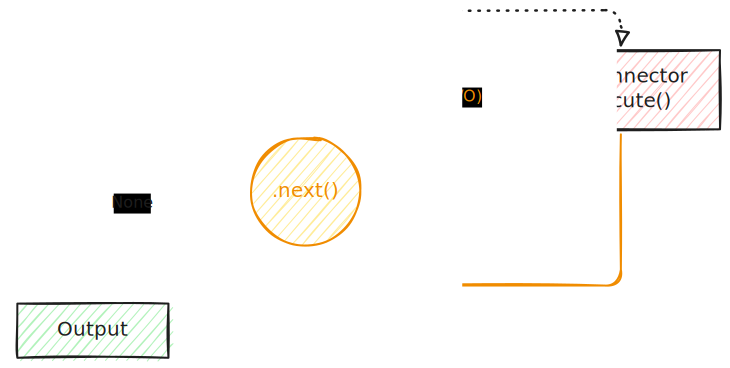

# ⚙ process [](https://matrix.to/#/#pimalaya:matrix.org)

Set of Rust libraries to manage processes.

## Why?

Designing a generic API for a library *that relies on I/O* is a real challenge. This project tries to solve that matter by abstracting away the I/O:

- The core lib exposes I/O-free, composable and iterable state machines (named flows)
- The I/O connector executes I/O everytime a flow `Iterator` produces an I/O request

```rust
let mut flow = Flow::new()
let conn = IoConnector::new();

while let Some(io) = flow.next() {
    conn.execute(&mut flow, io)?;
}

let output = flow.output()
```



## When?

✔ If you develop a library that relies on processes, then `process-lib` might help you.

✔ If you develop an application that uses `process-lib` flows, any I/O connector might help you. If you do not find the right built-in connector matching your needs, you can easily build your own. PRs are welcomed!

✘ If you develop an application *without* `process-lib`, then this project *might not* help you. Just use directly the process module matching your environment (`std::process`, `tokio::process` etc).

## Structure

- [`process-lib`](https://github.com/pimalaya/process/tree/master/lib): a set of I/O-free tools to deal with processes
- [`process-std`](https://github.com/pimalaya/process/tree/master/std): a standard, blocking I/O connector for `process-lib`
- [`process-tokio`](https://github.com/pimalaya/process/tree/master/tokio): Tokio-based, async I/O connector for `process-lib`

## Examples

### Spawn blocking process then wait for status

```rust
use process_lib::{Command, SpawnCommandThenWait};
use process_std::Connector;

fn main() {
    let conn = Connector::new();

    let mut command = Command::new("echo");
    command.arg("hello");
    command.arg("world");

    let mut flow = SpawnCommandThenWait::new(command);

    while let Some(io) = flow.next() {
        conn.execute(&mut flow, io).unwrap();
    }

    let status = flow.take_status().unwrap();
    println!("status: {status:#?}");

    // status: ExitStatus(
    //     unix_wait_status(
    //         0,
    //     ),
    // )
}
```

### Spawn Tokio process then wait for output

```rust
use process_lib::{Command, SpawnCommandThenWaitWithOutput};
use process_tokio::Connector;

fn main() {
    let conn = Connector::new();

    let mut command = Command::new("echo");
    command.arg("hello");
    command.arg("world");

    let mut flow = SpawnCommandThenWaitWithOutput::new(command);

    while let Some(io) = flow.next() {
        conn.execute(&mut flow, io).await.unwrap();
    }

    let output = flow.take_output().unwrap();
    println!("output: {output:#?}");

    // output: Output {
    //     status: ExitStatus(
    //         unix_wait_status(
    //             0,
    //         ),
    //     ),
    //     stdout: "hello world\n",
    //     stderr: "",
    // }
}
```

### Create a pipeline

```rust
use std::process::Stdio;

use process_lib::{Command, SpawnCommandThenWait, SpawnCommandThenWaitWithOutput};
use process_std::Connector;

fn main() {
    let conn = Connector::new();

    let mut command = Command::new("echo");
    command.arg("hello");
    command.arg("world");
    command.stdout(Stdio::piped());

    let mut flow = SpawnCommandThenWait::new(command);

    while let Some(io) = flow.next() {
        conn.execute(&mut flow, io).unwrap();
    }

    let stdout = flow.take_stdout().unwrap();

    // move stdout from previous command to next command stdin

    let mut command = Command::new("cat");
    command.arg("-E");
    command.stdin(stdout);

    let mut flow = SpawnCommandThenWaitWithOutput::new(command);

    while let Some(io) = flow.next() {
        conn.execute(&mut flow, io).unwrap();
    }

    let output = flow.take_output().unwrap();
    println!("output: {output:#?}");

    // output: Output {
    //     status: ExitStatus(
    //         unix_wait_status(
    //             0,
    //         ),
    //     ),
    //     stdout: "hello world$\n",
    //     stderr: "",
    // }
}

```

*See more examples at [`process-std/examples`](https://github.com/pimalaya/process/tree/master/process-std/examples) and [`process-tokio/examples`](https://github.com/pimalaya/process/tree/master/process-tokio/examples).*

## Sponsoring

[](https://nlnet.nl/)

Special thanks to the [NLnet foundation](https://nlnet.nl/) and the [European Commission](https://www.ngi.eu/) that helped the project to receive financial support from various programs:

- [NGI Assure](https://nlnet.nl/project/Himalaya/) in 2022
- [NGI Zero Entrust](https://nlnet.nl/project/Pimalaya/) in 2023
- [NGI Zero Core](https://nlnet.nl/project/Pimalaya-PIM/) in 2024 *(still ongoing)*

If you appreciate the project, feel free to donate using one of the following providers:

[](https://github.com/sponsors/soywod)
[](https://ko-fi.com/soywod)
[](https://www.buymeacoffee.com/soywod)
[](https://liberapay.com/soywod)
[![thanks.dev](https://img.shields.io/badge/-thanks.dev-000000?logo=data:image/svg+xml;base64,PHN2ZyB3aWR0aD0iMjQuMDk3IiBoZWlnaHQ9IjE3LjU5NyIgY2xhc3M9InctMzYgbWwtMiBsZzpteC0wIHByaW50Om14LTAgcHJpbnQ6aW52ZXJ0IiB4bWxucz0iaHR0cDovL3d3dy53My5vcmcvMjAwMC9zdmciPjxwYXRoIGQ9Ik05Ljc4MyAxNy41OTdINy4zOThjLTEuMTY4IDAtMi4wOTItLjI5Ny0yLjc3My0uODktLjY4LS41OTMtMS4wMi0xLjQ2Mi0xLjAyLTIuNjA2di0xLjM0NmMwLTEuMDE4LS4yMjctMS43NS0uNjc4LTIuMTk1LS40NTItLjQ0Ni0xLjIzMi0uNjY5LTIuMzQtLjY2OUgwVjcuNzA1aC41ODdjMS4xMDggMCAxLjg4OC0uMjIyIDIuMzQtLjY2OC40NTEtLjQ0Ni42NzctMS4xNzcuNjc3LTIuMTk1VjMuNDk2YzAtMS4xNDQuMzQtMi4wMTMgMS4wMjEtMi42MDZDNS4zMDUuMjk3IDYuMjMgMCA3LjM5OCAwaDIuMzg1djEuOTg3aC0uOTg1Yy0uMzYxIDAtLjY4OC4wMjctLjk4LjA4MmExLjcxOSAxLjcxOSAwIDAgMC0uNzM2LjMwN2MtLjIwNS4xNTYtLjM1OC4zODQtLjQ2LjY4Mi0uMTAzLjI5OC0uMTU0LjY4Mi0uMTU0IDEuMTUxVjUuMjNjMCAuODY3LS4yNDkgMS41ODYtLjc0NSAyLjE1NS0uNDk3LjU2OS0xLjE1OCAxLjAwNC0xLjk4MyAxLjMwNXYuMjE3Yy44MjUuMyAxLjQ4Ni43MzYgMS45ODMgMS4zMDUuNDk2LjU3Ljc0NSAxLjI4Ny43NDUgMi4xNTR2MS4wMjFjMCAuNDcuMDUxLjg1NC4xNTMgMS4xNTIuMTAzLjI5OC4yNTYuNTI1LjQ2MS42ODIuMTkzLjE1Ny40MzcuMjYuNzMyLjMxMi4yOTUuMDUuNjIzLjA3Ni45ODQuMDc2aC45ODVabTE0LjMxNC03LjcwNmgtLjU4OGMtMS4xMDggMC0xLjg4OC4yMjMtMi4zNC42NjktLjQ1LjQ0NS0uNjc3IDEuMTc3LS42NzcgMi4xOTVWMTQuMWMwIDEuMTQ0LS4zNCAyLjAxMy0xLjAyIDIuNjA2LS42OC41OTMtMS42MDUuODktMi43NzQuODloLTIuMzg0di0xLjk4OGguOTg0Yy4zNjIgMCAuNjg4LS4wMjcuOTgtLjA4LjI5Mi0uMDU1LjUzOC0uMTU3LjczNy0uMzA4LjIwNC0uMTU3LjM1OC0uMzg0LjQ2LS42ODIuMTAzLS4yOTguMTU0LS42ODIuMTU0LTEuMTUydi0xLjAyYzAtLjg2OC4yNDgtMS41ODYuNzQ1LTIuMTU1LjQ5Ny0uNTcgMS4xNTgtMS4wMDQgMS45ODMtMS4zMDV2LS4yMTdjLS44MjUtLjMwMS0xLjQ4Ni0uNzM2LTEuOTgzLTEuMzA1LS40OTctLjU3LS43NDUtMS4yODgtLjc0NS0yLjE1NXYtMS4wMmMwLS40Ny0uMDUxLS44NTQtLjE1NC0xLjE1Mi0uMTAyLS4yOTgtLjI1Ni0uNTI2LS40Ni0uNjgyYTEuNzE5IDEuNzE5IDAgMCAwLS43MzctLjMwNyA1LjM5NSA1LjM5NSAwIDAgMC0uOTgtLjA4MmgtLjk4NFYwaDIuMzg0YzEuMTY5IDAgMi4wOTMuMjk3IDIuNzc0Ljg5LjY4LjU5MyAxLjAyIDEuNDYyIDEuMDIgMi42MDZ2MS4zNDZjMCAxLjAxOC4yMjYgMS43NS42NzggMi4xOTUuNDUxLjQ0NiAxLjIzMS42NjggMi4zNC42NjhoLjU4N3oiIGZpbGw9IiNmZmYiLz48L3N2Zz4=)](https://thanks.dev/soywod)
[](https://www.paypal.com/paypalme/soywod)
